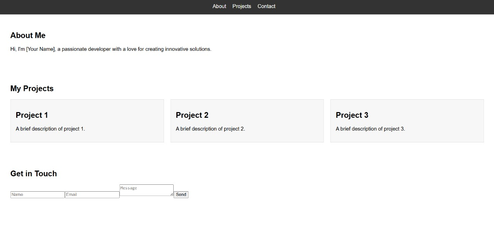
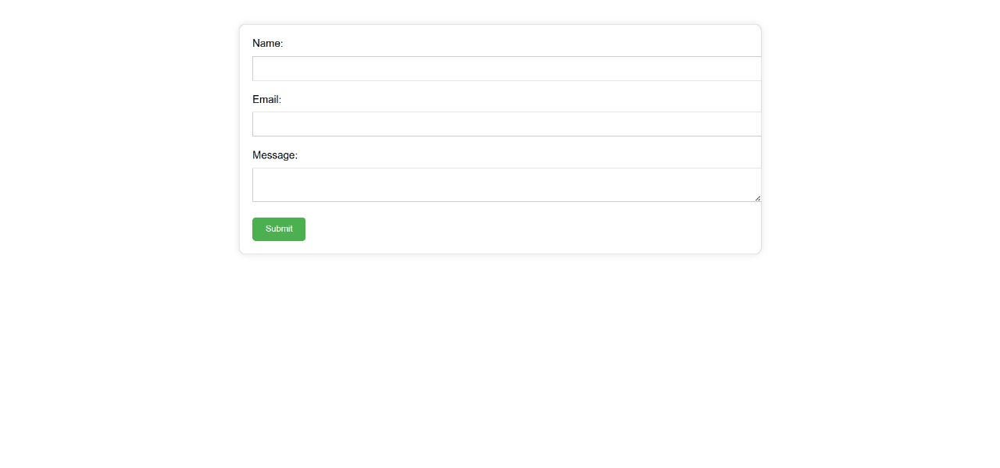
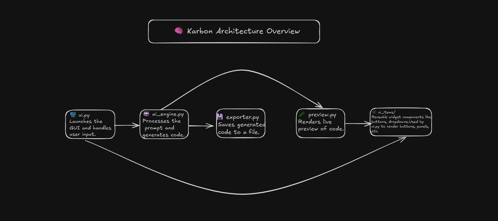

# 🚀 Karbon - AI Web Builder

**Karbon** is a desktop app that uses AI to generate and iteratively refine HTML/CSS/JS websites from simple prompts. Built with Python and Tkinter, it provides a live preview and export functionality.

# Screenshots
 
<div style="overflow-x: auto; white-space: nowrap;">
  
  
  
  
</div>

---

## 🧠 Features

- 🔤 Prompt-based website generation using AI
- 🛠️ Iterative prompt-based updates to the code
- 🖼️ Live preview in a browser window
- 📤 Export final code to HTML/CSS/JS files
- 🎛️ Simple and intuitive Tkinter GUI

---

## ⚙️ Installation

### 1. Clone the repository

```bash
git clone https://github.com/prakhardoneria/karbon.git
cd karbon
````

### 2. Install dependencies

```bash
pip install -r requirements.txt
```

---

## ▶️ Running the App

```bash
python main.py
```

> The app window will launch, allowing you to enter a prompt to generate your first website layout.

---

## 📁 Project Structure

```
karbon/
├── main.py                    # Main application entry point
├── ui.py                      # Legacy UI entry point (deprecated)
├── contributors_page.py       # Contributors page UI
├── code_editor_ui.py         # Code editor interface
├── 
├── core/                     # Core functionality
│   ├── ai_engine.py          # AI generation engine
│   ├── token_manager.py      # API token management
│   ├── prompt_history.py     # Prompt history management
│   └── prompt_drafts_system.py # Draft system
│
├── ui_items/                 # UI components
│   ├── karbon_ui.py          # Main UI controller
│   ├── prompt_view.py        # Prompt input interface
│   ├── editor_view.py        # Code editor view
│   ├── contributors_view.py  # Contributors display
│   └── token_manager_view.py # Token management UI
│
├── exporters/                # Export functionality
│   ├── exporter.py           # General export functions
│   ├── github_exporter.py    # GitHub export
│   └── repo_pusher.py        # Repository management
│
├── utils/                    # Utility functions
│   ├── preview.py            # Preview functionality
│   └── project_io.py         # Project I/O operations
│
├── tests/                    # Test suite
│   └── test_dummy.py         # Basic tests
│
├── assets/                   # Static assets
├── docs/                     # Documentation
└── requirements.txt          # Python dependencies
```

---

## 🛠️ Building Executable (Windows)

Use [PyInstaller](https://pyinstaller.org/) to create a standalone `.exe`:

```bash
pyinstaller ui.py --onefile --noconsole --name Karbon --icon=icon.ico
```

The built executable will appear in the `dist/` folder.

---

## 📦 Release via GitHub Actions

On push to the `main` branch, GitHub Actions will:

* Build `Karbon.exe` using PyInstaller
* Create a GitHub release with the `.exe` attached

See `.github/workflows/build-karbon.yml` for details.

---

## 📁 Project Structure

```
karbon/
├── ui.py                  # Main UI launcher
├── ai_engine.py           # Handles AI code generation
├── exporter.py            # Exports final code to files
├── preview.py             # Opens code in browser preview
├── ui_items/              # Modularized UI components
│   ├── __init__.py
│   ├── prompt_view.py
│   ├── editor_view.py
│   └── karbon_ui.py
├── requirements.txt
├── .gitignore
└── README.md
```

---

## 🧪 Example Prompts and Outputs

Here are some example prompts you can try in Karbon, along with typical outputs:

---

### 🔹 Prompt: “Create a login page using HTML and Tailwind CSS”
**Output:** Generates a login page which takes user's Username and Password as input for Login.


---

### 🔹 Prompt: “Build a personal portfolio page with sections for About, Projects, and Contact”
**Output:** Generates HTML/CSS with an About Me, My projects and Get in Touch.



---

### 🔹 Prompt: “Design a landing page for a mobile app with a pricing section and testimonials”
**Output:** Renders a landing page layout with Pricing Plans, and What Our Users Say.

.jpg)
.jpg)

---

### 🔹 Prompt: “Create a dark-themed blog homepage with a navbar and featured articles”
**Output:** Creates a dark-themed homepage with navbar having Home, About, Contact and features articles with images.


---


### 🔹 Prompt: “Generate a simple form to collect name, email, and message with a submit button”
**Output:** Creates a form with labeled input fields and a submit button, styled using CSS.



---

## 📊 Architecture

The following diagram illustrates Karbon's high-level architecture.  
It shows how user input flows from the GUI to the AI engine and how the generated code is previewed and exported.  
This structure makes the project modular, easier to maintain, and simple to extend.




## 🧑‍💻 Contributing

Pull requests are welcome! To contribute:

1. Fork the repo
2. Create a feature branch (`git checkout -b feature/new-feature`)
3. Commit your changes (`git commit -m 'Add feature'`)
4. Push to the branch (`git push origin feature/new-feature`)
5. Open a pull request

---

## 📝 License

GNU General Public License v3.0. See `LICENSE` file for details.

---


